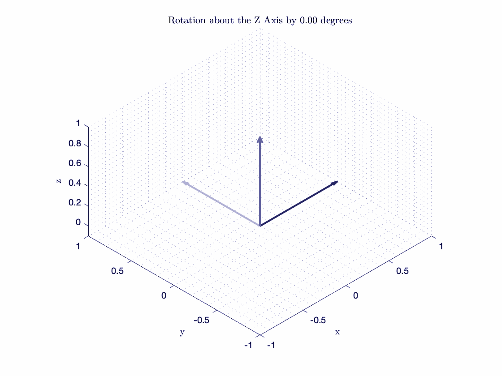

# Transformation Matricies Web App

[](https://robotics-transformation.streamlit.app)

A [Streamlit](https://streamlit.io) demo [written in pure Python](https://github.com/BrianLesko/Robotics/blob/main/CoordinateFrameAnimation/TransformationMatriciesDemo.py)
to visualize coordinate frames for robotics engineering and modeling software right in python.



This repository subfolder exists to demonstrate a foundational topic in modern robotics and system autonomy: 

transformations and coordinate systems. How are they represented and how do robots keep track of them? 

One approach is using transformation matricies, which are 4x4 and store position and orientation relative to another coordinate frame. 
These matricies are useful because they can represent orientation and position, but they can also transform a coordinate frame to another through matrix multiplication, a linear algebra topic.

Transformation matricies can be used in many fields, control systems, robotics, vehicle autonomy, and data collection.

Heres one example:
Data collected from multiple camera sensors needs to be described relative to a single coordinate system, but each camera collects data relative to itself. This is an easy application of transformation matricies.

Check out the web app associated to this repository subfolder [here](https://robotics-transformation.streamlit.app) 

About me: Hi, Im Brian Lesko, I started my github in 2022 while studying at Ohio State for my Masters in Mechanical Engineering. I hope you can find my work here useful
I want to help others and in the process get better at documenting what I love. If you like my work, go check out some of my other projects and connect with me. Im open to collaborating. 

### Repo Links 

Check out my robust controls repository [here](https://github.com/BrianLesko/RobustControls)

Check out my machine learning and AI repository [here](https://github.com/BrianLesko/MachineLearning)

### Social Links 

Check out my LinkedIn [here](https://www.linkedin.com/in/brianlesko/)

## Run this demo locally
```
pip install --upgrade streamlit
streamlit run https://github.com/BrianLesko/Robotics/blob/main/CoordinateFrameAnimation/TransformationMatriciesDemo.py
```


 


